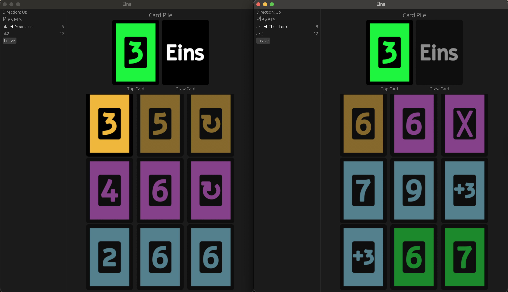

**Final Project Proposal**

* Group Name: **1**  
* Group member names and NetIDs:   
  Anuj Awasthi  
  Akshat Kumar Shahi
  Kalin Patel  
  Anthony Santiago  
* Project Introduction  
  * An app for playing a game like **Uno** with a web server for playing with friends over LAN.  
  * This project will help college students connect on campus and bond over a universally recognized game. Also, this project will help us learn how to implement a self-hosted websocket server across a local network and practice with client-server architecture and handling real-time state across multiple users.    
* Technical Overview  
  * Please provide a moderate-length technical description of the major components of your project. This should also function as a sort of ‘roadmap’ for tasks you need to complete for your project to be functional.  
  * **Game Logic:**  
    * Handle player moves, wins, and losses  
    * Initialize and shuffle deck (deal cards to players)  
    * Enforce turn order (might be a reverse card)  
    * Validate card moves (proper color/number)  
    * Handle draw stack logic (+2 and \+4s)  
    * Prompt users to click Uno when on one card  
    * Game ending condition (no cards)  
  * **Self-Hosted Websocket server**:  
    * Game admin starts the game, hosting the webserver on their device  
    * Players join via IP with a unique username, establishing a websocket connection with the host  
    * Websocket connections handled via **tokio-tungstenite**  
    * Struct should hold a list of current players’ usernames and websocket connections  
    * Webserver receives requests for moves and sends updates to game logic  
    * Webserver sends updates about game state to all clients  
    * Check if user is the host based on origin of websocket connection  
  * **Game Interface:**  
    * Display cards in hand and allow for player choice of card to play  
    * Allows player to select a card in their hand  
    * Allows player to pick up from the deck  
    * Allows player to ‘play’ their hand  
    * Show player turn indicator  
    * Show admin controls to the game host

* **Checkpoint Deadlines:**  
  * Checkpoint 1(4/7): Setup game logic  
  * Checkpoint 2(4/21): Setup server and client connection  
  * By final deadline: Game Interface  
* Possible Challenges  
  * UI/UX Design for the game  
  * Implementing and syncing each players hands (hidden data)  
  * Establishing and maintaining websocket connections  
* References  
  * Inspiration taken from card game UNO
